# Hashy

Problem 2 Option 1

Experience with DHT with kademlia library in Python 3.

## Requirements

-   Tested on Mac OS only, this can be run on Linux and Window system with some modification.

-   `Python 3` install [HERE](https://www.python.org/downloads/)
    -   Use `python --version` to make sure your python is version 3.0+
-   `Kademlia`: A distributed hash table designed for decentralized peer-to-peer computer networks.
-   `Asyncio`: Facilitates keeping the program running asynchronously.
-   `Aioconsole`: Enables asynchronous input handling.
-   `Pillow`: Library for image encoding and decoding.
-   `Lorem-text`: Library for generating testing strings.

## Data Usage to Measure

A set of images in folder `to_send` are picked with various sizes and types:

-   1_24kb.jpeg
-   2_360kb.png
-   3_2mb.jpg
-   4_10mb.png
-   5_15mb.png
-   6_18mb.png
-   7_19mb.png

A set of random lorem ipsum string are generated.

## Measurement Design

-   Duration is not included:
    -   the time to encode, decode the image.
    -   the time to generate strings.
    -   the time to save csv, or save image.

### Files, `RECORDS` folder

-   **Data is manipulated into `report.xlsx` for the purpose of graphing, from:.**

    -   `img_read.csv`: Image information such as image name, image size, image chunk from the network, and read/download duration are reported to this file.
    -   `img_write.csv`: Image name, image size, number of chunks, average chunk size, number of bytes totally, and upload duration are reported to this file.
    -   `str_read.csv`: key, length of value, and read duration are reported to this file.
    -   `str_write.csv`: key, length of value, and set duration are reported to this file.

At the end of each table in `report.xlsx`, there are average duration.

### Other files:

-   `Records` folder have reports used to make this report. Contains `e1`, `e2`, `e3` folders for collected experience data.
-   `Report` folder uses to save `.csv` files after recording duration.
-   `download` folder uses to save download images from the networks.

## Installation

1. Go to `Hashy` directory, use the following command to install all dependencies:

```bash
pip install -r requirements.txt
```

## How to Run

### To Start an initial node (I call it server)

In Hashy directory, use the following command:

```bash
python server.py <PORT>
```

-   Where `<PORT>` is the unused PORT number that you want your server running on.

Example: `python server.py 5678`

### To Start Other Nodes and Join the Network

In the Hashy directory, use the following command:

```bash
python peer.py <NETWORK_PORT> <PORT>
```

### Commands

1. Pick action

    - Type `s` to set value to the network
    - Type `g` to get value from the network

    ```bash
    Set [s], Get [g], Clear Screen[c] or Quit [q]:
    ```

2. Pick type of value to set

    - Type `kv` if you want to set key and value pair to the network
    - Type `img` if you want to upload an image to the network

    ```bash
    Enter type <key,value> [kv], image [img], defined img [ai] lorem mode[l]:
    ```

    If it's image, please enter full path to the image.

    For example: `'/Users/USER_NAME/Hashy/to_send/7_19mb.png'`

    ```bash
    Enter the file path [.jpg|.jpeg|.png]:
    ```

    - Type `ai` to send a set of defined images in folder `to_send`
        - For testing purpose, Images in `to_send` must be kept ORIGINAL
    - Type `l` to send 200 random lorem ipsum in various size
        - For testing purpose, key and value will not be displayed at run time
        - Use `g` to get desired key:value
            - For example, the key can be `lorem_0`, `lorem_5`,... `lorem_1000`

3. Pick type of value to get

    - Type `k` to get a value of a key.
    - Type `img` to download the image with image name without extension
    - Type `ai` to download the defined images that WAS UPLOADED to the networks
        - Download to the `download` folder in `Hashy` directory
    - Type `l` to get 200 key:values that was SET to the netoworks
        - For the testing purpose, `l` mode will not show you the result.

    ```bash
    Enter type key [k], image [img], defined img [ai], lorem mode [l]:
    ```

Where

-   `<NETWORK_PORT>` is the port of the server, or other running nodes in the network.

-   `<PORT>` is the unused PORT number on your machine that you want your node running on.

Example: To connect to the initial network running on port `5678` and I have port `6000` free/unused on my machine.

-   Run: `python peer.py 5678 6000`

## Showcases

## Experience 1

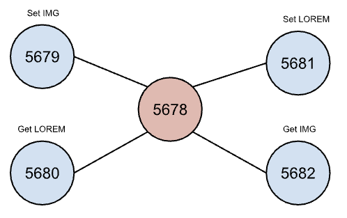

1. Start a Node at port `5678`
2. Start other Nodes at port `5679`, `5680`, `5681`, `5682` and connect them to the network (port `5678`)
3. Set a given Images to the network on port `5679` and set a random Lorem Text on port `5681` to the network.
4. On port `5682`, get a set of Images, and on port `5680`, get a set of Lorem Text from the network.

### Steps

Create the network following Graph 1 above.

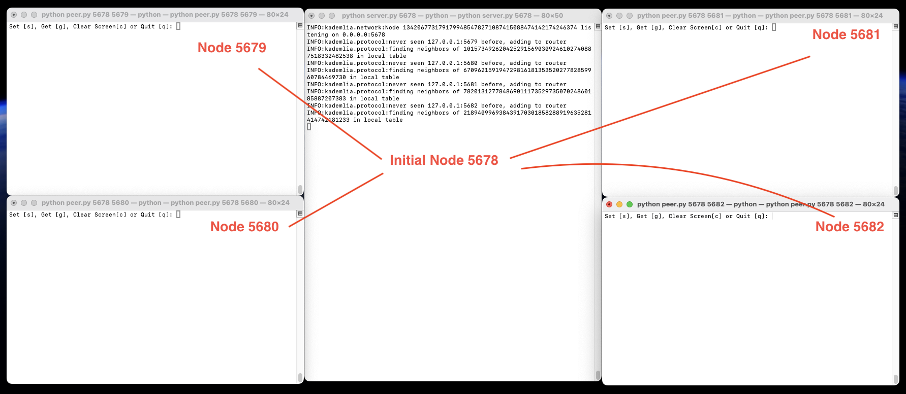

Upload images and lorem ipsum strings.

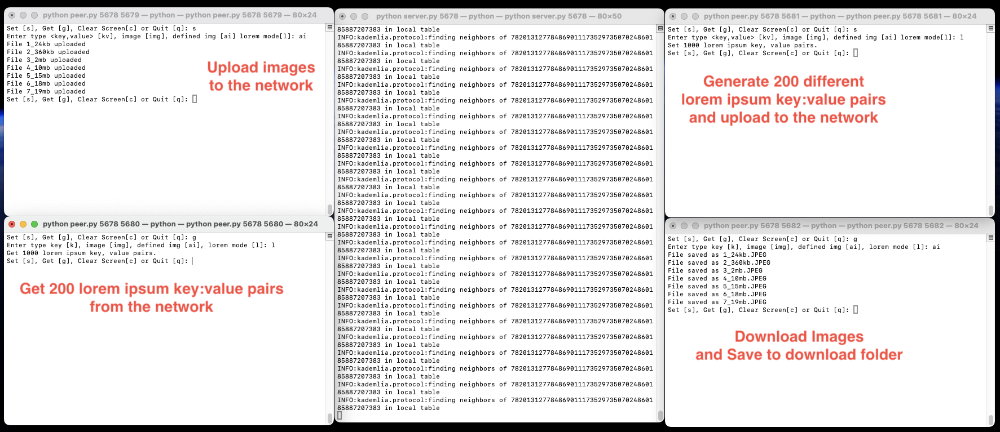

### Measurements:

-   Graph 1: Write and Read Images Duration

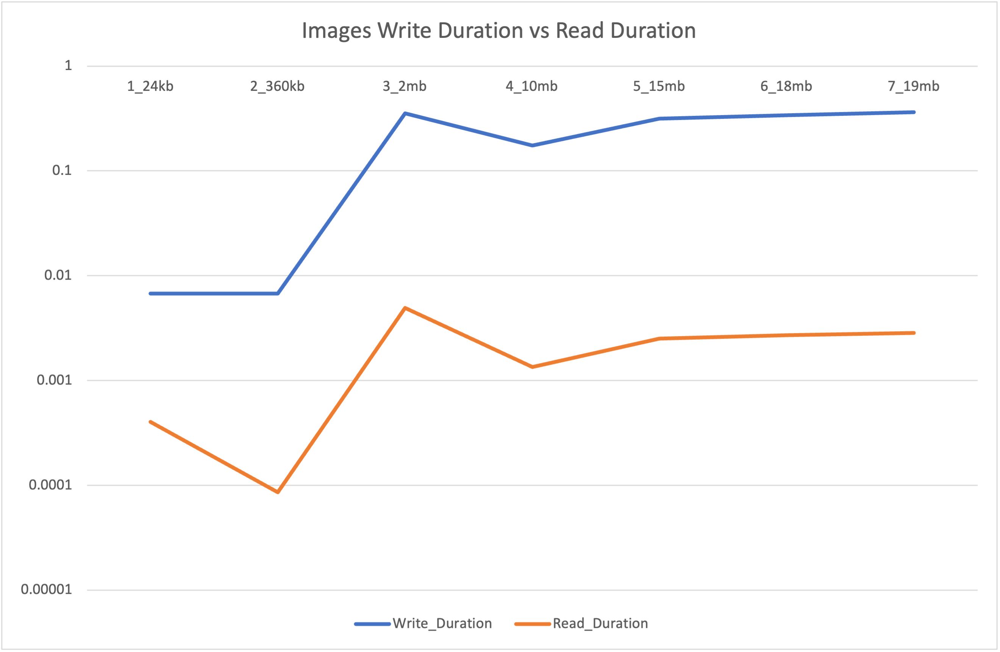

-   Graph 2: Duration of set and get 200 lorem ipsum, each string increase by 5 words

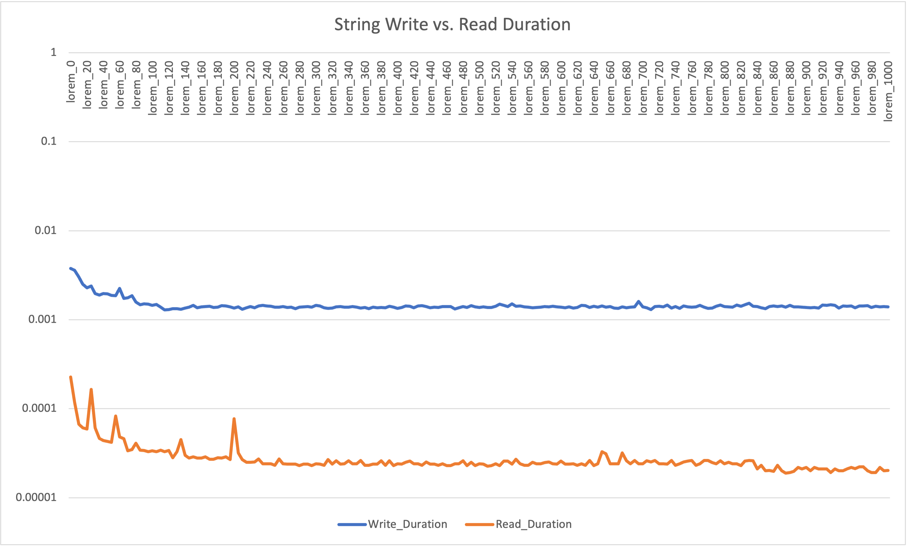

### Discussion

Purpose of experience 1 is to explore how the DHT network works by setting up a central node, and let other peers connect to the central node.

-   In Graph 1, Write duration is significantly slower than read duration (Images).

    -   Write an image to DHT system is about `221 ms` slower than read an image.

-   In Graph 2, Write duration is also significantly slower than read duration (Strings).
    -   Write a string to DHT system is about `1.44 ms` slower than read a string.

<hr/>

## Experience 2

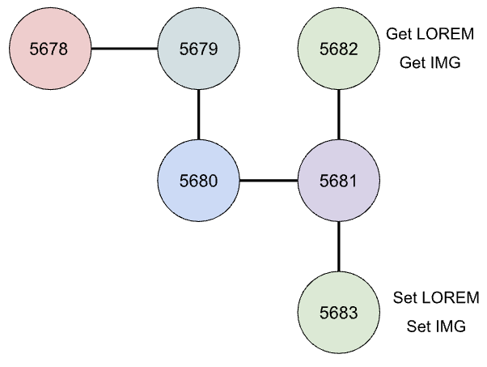

### Steps

1. Start a Node at port `5678`
2. Start Node `5679` and connect to `5678`
3. Start Node `5680` and connect to `5679`
4. Start Node `5681` and connect to `5680`
5. Start Node `5682` and Connect to `5681`
6. Start Node `5683` and Connect to `5681`
7. Set Images and Lorem from Node `5683` to the network
8. Get Images and Lorem at Node `5682`

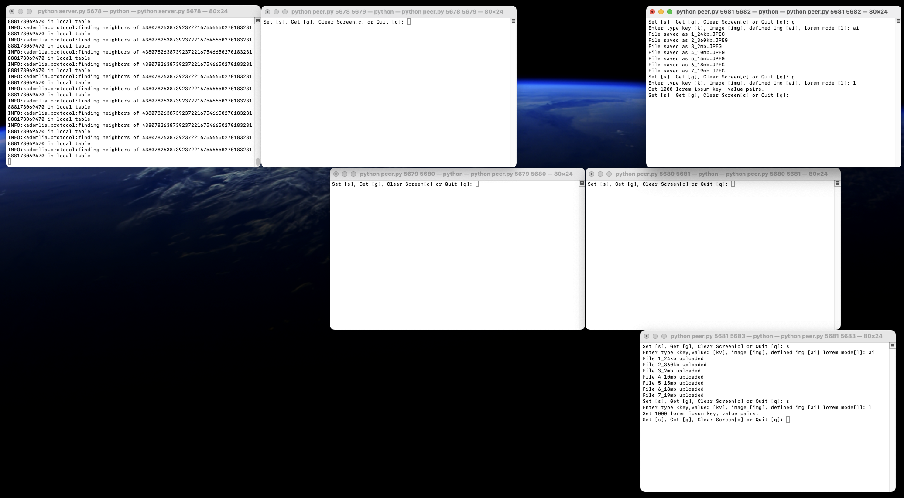

### Measurements

-   Graph 1: Write and Read Images Duration:

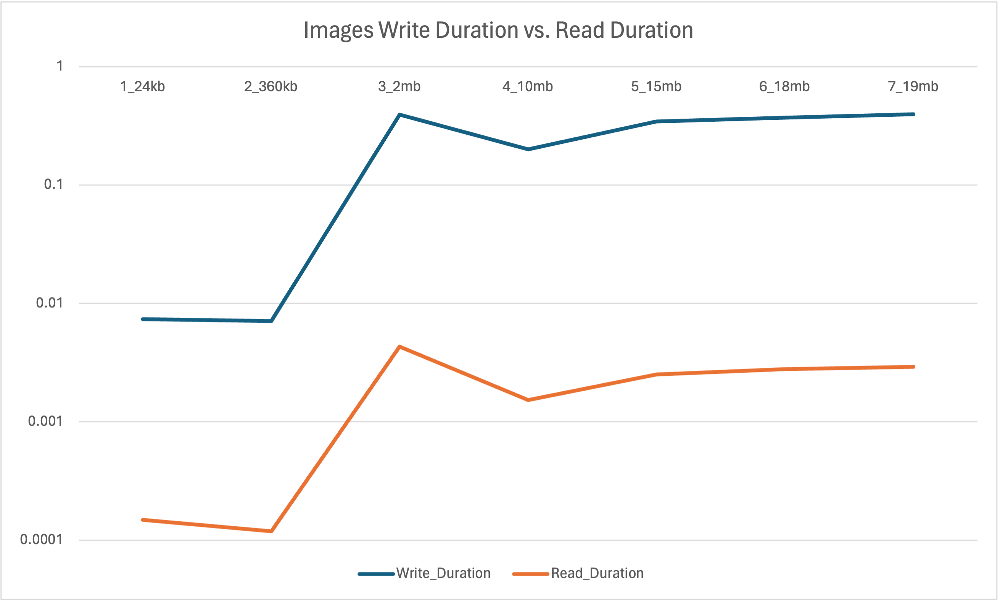

-   Graph 2: Duration of set and get 200 lorem ipsum, each string increase by 5 words

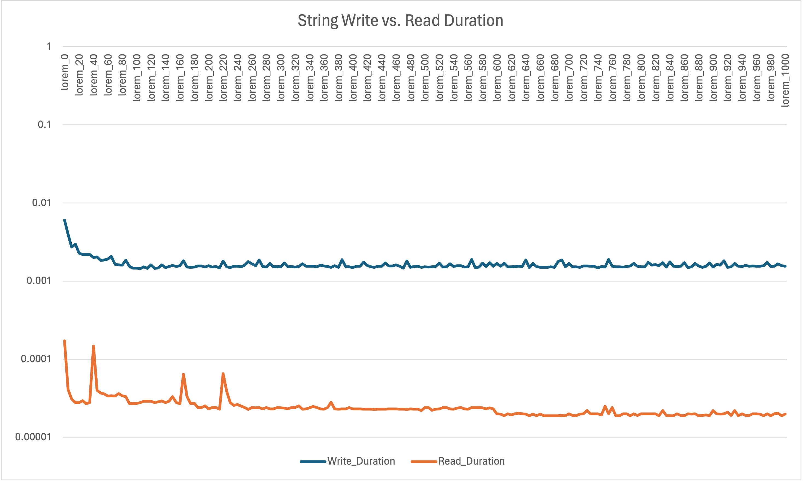

### Discussion

Purpose of experience 2 is to measure the performance of write and read if a node is far away from inital node.

-   In Graph 1, Write duration is significantly slower than read duration (Images).

    -   Write an image to DHT system is about `243 ms` slower than read an image.

-   In Graph 2, Write duration is also significantly slower than read duration (Strings).
    -   Write a string to DHT system is about `1.62 ms` slower than read a string.

<hr/>

## Experience 3

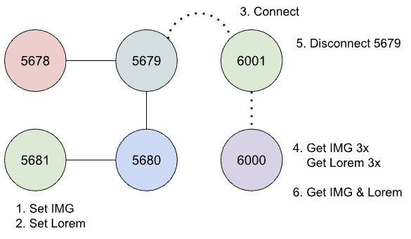

#### Steps

1. Start Node `5678`
2. Start Node `5679` and connect to `5678`
3. Start Node `5680` and connect to `5679`
4. Start Node `5681` and connect to `5680`
5. Set Images and Lorem at Node `5681`
6. Start Node `6001` and connect to Node `5679`
7. Start Node `6000` and connect to Node `6001`
8. Get Images and Lorem at Node `6000` **3 times** to measure
9. Disconnect Node `5679` from the Network
10. Get Images and Lorem at Node `6000`

Write before `6000` and `6001` connect:

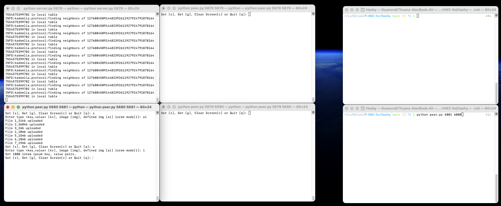

Write `3x time`

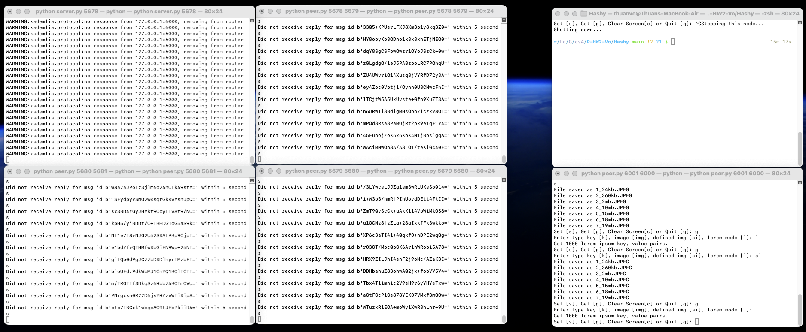

#### Measurements:

-   Graph 1: Images Write Duration at Node 5681 vs. Average Read Duration at Node 6000 after connect vs. Read Duration at Node 6000 after disconnect Node 6001 from the network:


-   Graph 2: String Write Duration at Node 5681 vs. Average Read Duration at Node 6000 after connect vs. Read Duration at Node 6000 after disconnect Node 6001 from the network:

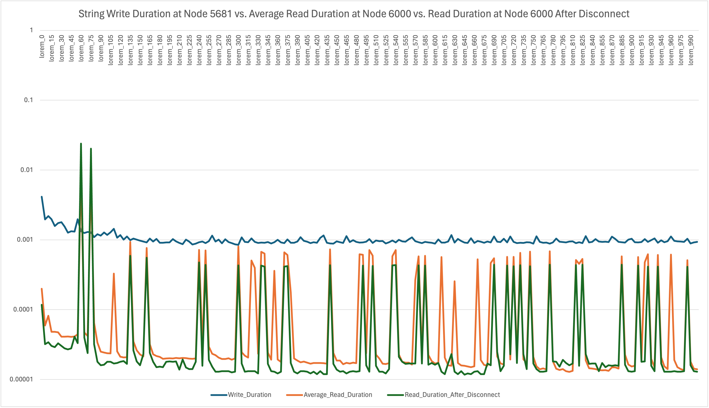

### Discussion

The purpose of experience 3 is to measure performance of get data from DHT system if a node joined the network after the data is set. To see if the new node takes more time to discover the data in the existing network. Also, we want to see if a neighbor peer left the network, does it affect the ability to discover the network of its peers.

As we can observe from graph 1, the data has been set, after Node `6000` joins the network:

-   It take Node `6000` slower than Experience 1 and 2 to read, Average of `746 ms`.
-   After 6001 left the network, the node 6000 lost a peer, it takes 6000 about `40 ms` to read from the network.

As we can observe from graph 2:

-   It takes Node `6000` about average of `0.23 ms` to read strings from the network after joining.
-   After 6001 left the network, it takes Node `6000` about `0.30 ms` to read strings from the networks.

## General Discussion

> **Each experience above has its own discussion.**

Compare 3 experiences:

| Read/Write    | Experience 1 | Experience 2 |
| ------------- | ------------ | ------------ |
| Avg Write Img | 223.0 ms     | 245.5 ms     |
| Avg Read Img  | 2.11 ms      | 2.04 ms      |
| Avg Write Str | 1.47 ms      | 1.65 ms      |
| Avg Read Str  | 0.03 ms      | 0.25 ms      |

-   Experience 3:
    -   Images:
        -   Average write duration: `147.37 ms`
        -   Average read duration after join: `746.4 ms`
        -   Average read duration after disconnect peer: `40.2 ms`
    -   Strings:
        -   Average write duration: `1.03 ms`
        -   Average read duration after join: `0.23 ms`
        -   Average read duration after disconnect peer: `0.30 ms`

From the data collected above:

-   The more nodes in the network, the further the set/get node from the initial node, it may take more time to write to the network. However, the performance is not significantly different for writing/setting to the network.
-   If the node joins after the data is set, it may take the node more time to discover and get data from the existing network.
    -   Experience 1 and 2: it takes about `2 ms` to read/get images.
    -   However, in experience 3, after node 6000 joins the network, it takes `node 6000` up to `750 ms` to explore and get the images.
    -   Why does experience 3 take less time to write data (images/strings) to the network?
        -   It could be because there are fewer nodes than in experiences 1 and 2 when it writes the data in step 5.
-   If the node joins lost a peer it connected to, it also takes more time to read data from the network.
    -   The average time to read images (experience 3) is `40.2 ms`, slower than both experiences 1 and 2 (`2 ms`).
    -   The average time to read strings in experience 3 is `0.30 ms`, also slower than experience 1 (`0.03 ms`), but not significantly compared to experience 2 (`0.25 ms`).

Some observations from experiences 1, 2, 3:

-   The heavier the images, the longer it takes to write and read from the networks.
-   Longer strings do not significantly take longer to write to the networks.

Why do I break images into chunks of bytes?

-   For each <key:value>, the maximum length of `value` is 8000. Therefore, the only way to save an image in the DHT system is to save many chunks of bytes.
-   Each image can have hundreds of chunks, each chunk is full of 8000 bytes. While each regular string doesn't reach the maximum of 8000 bytes. Therefore, getting an image of 100 chunks takes significantly more time and is slower than getting 100 <key:value> pairs.

How do I break them into chunks?

    For any image, lower the quality to 85% of the original quality.
    Then, it will be broken into chunks of 8000 bytes.

    To save in the DHT networks:

    1. Set IMAGE_NAME:NUMBER_OF_CHUNKS
    2. Set all the chunks with the key IMAGE_NAME_i where i is the index of the chunk.

-   The DHT system is fast in the 3 experiences above, and it can have many applications. However, consider encrypting data before sending it to the system to securely store data since everyone in the network can access your data by having the key.

## References

-   [Distributed Hash Tables with Kademlia](https://codethechange.stanford.edu/guides/guide_kademlia.html)
-   [Kademlia Documentation](https://kademlia.readthedocs.io/en/latest/)
-   [Pillow Documentation](https://pillow.readthedocs.io/)
-   [Async IO in Python: A Complete Walkthrough](https://realpython.com/async-io-python/)
